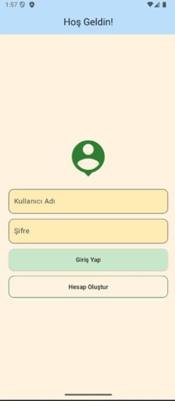
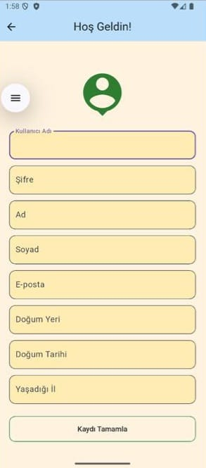
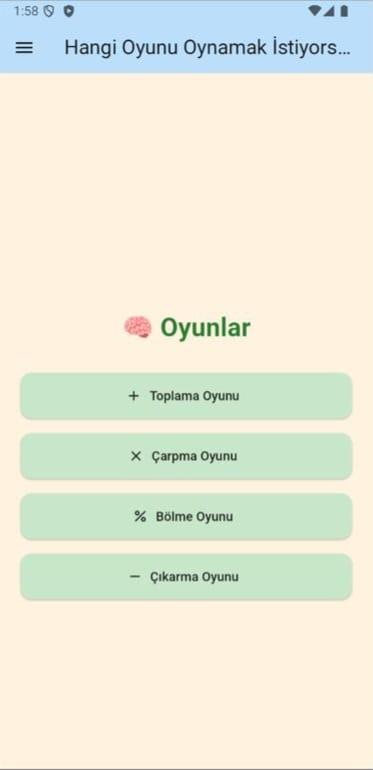
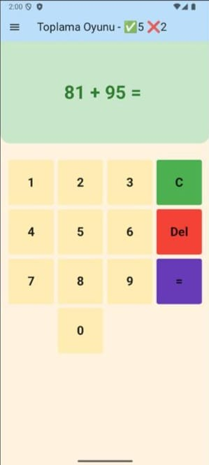
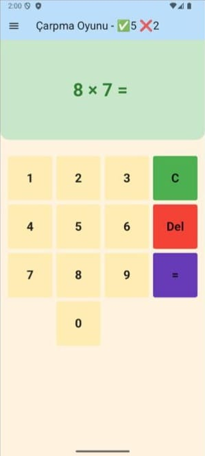
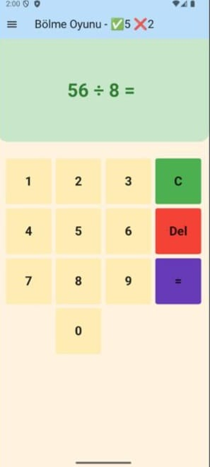
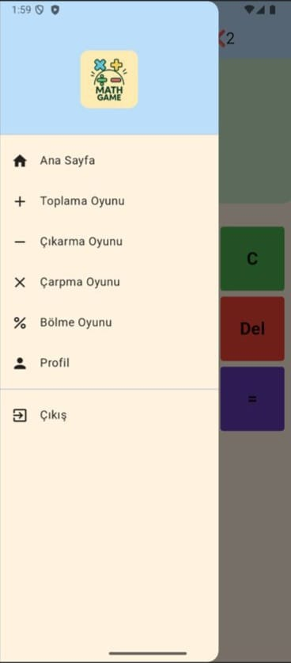
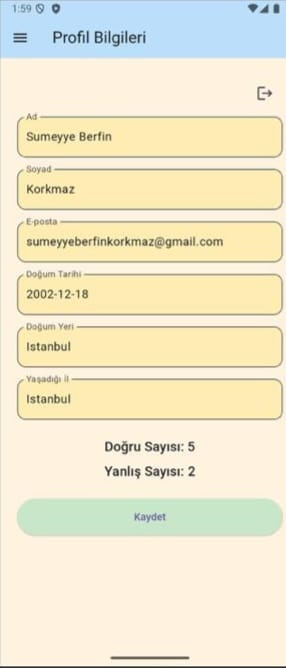

🌝 Math Game for Kids - Flutter Uygulaması

Math Game for Kids, çocuklara matematiği eğlenceli ve öğretici bir şekilde öğretmeyi amaçlayan Flutter tabanlı bir mobil uygulamadır. Uygulama; toplama, çıkarma, çarpma ve bölme işlemlerini oyun yoluyla sunarken, kullanıcıların skorlarını da kişisel olarak takip eder.

⸻

🎯 Projenin Amacı

Bu projenin amacı; çocuklara yönelik sade ve kullanıcı dostu bir arayüzle matematik işlemlerini oyunlaştırarak öğretmek, aynı zamanda her kullanıcı için kişisel başarı takibi yapılmasını sağlamaktır.

⸻

🛠️ Kullanılan Teknolojiler
•	Flutter: Uygulamanın temel geliştirme platformu
•	Shared Preferences: Skor ve kullanıcı verilerini cihazda saklama
•	HTTP: Logo verilerinin API üzerinden alınması
•	Dart: Flutter uygulama dili

⸻

🌟 Öne Çıkan Özellikler
•	✨ Her kullanıcıya özel doğru/yanlış skor kaydı
•	👤 Hesap oluştururken ad, soyad, doğum tarihi, doğum yeri, e-posta ve şehir bilgileri alma
•	🔄 Drawer menüsünden erişilebilen profil ekranı ve bilgilerde güncelleme imkânı
•	🎨 Çocuk dostu pastel renklerle sade arayüz
•	🔐 Login ve kullanıcı sistemi
•	🌐 Dış kaynaklı API’den dinamik logo yükleme
•	🧲 Dört işlem türüne özel oyun ekranları

⸻

📁 Proje Yapısı

lib/
├── main.dart
├── pages/
│   ├── login_page.dart
│   ├── home_page.dart
│   ├── home_page_addition.dart
│   ├── home_page_substraction.dart
│   ├── home_page_multipication.dart
│   ├── home_page_division.dart
│   └── profile_page.dart
├── util/
│   ├── my_button.dart
│   ├── result_message.dart
│   └── const.dart
├── preferences_service.dart
└── custom_drawer.dart

⸻

🧹 Sayfaların Görevleri ve İçerikleri

1. 🔐 login_page.dart 
   

   •	Kullanıcı adı ve şifre ile giriş yapılmasını sağlar.
   •	Yeni kullanıcı oluşturma imkânı sunar.
   •	Giriş sonrası kullanıcıyı ana sayfaya yönlendirir.
   •	Kullanıcıdan ad, soyad, doğum tarihi, doğum yeri, e-posta ve yaşadığı il gibi bilgileri alır.
   •	Veriler SharedPreferences ile saklanır.

2. 🏠 home_page.dart 

   •	Kullanıcının işlemlerden birini seçmesini sağlar (toplama, çıkarma, çarpma, bölme).
   •	Drawer menüsü ile tüm sayfalara geçiş imkânı sunar.
   •	Renkli butonlarla sade ve çekici arayüz sunar.

3. ➕ home_page_addition.dart 

   •	Toplama işlemleriyle ilgili oyun ekranıdır.
   •	Rastgele 2 sayı üretir.
   •	Kullanıcıdan cevap alır ve doğru/yanlış kontrolü yapar.
   •	Skoru günceller ve sonucu popup olarak gösterir.

4. ➖ home_page_substraction.dart 

   •	Çıkarma işlemleri için oyun ekranıdır.
   •	Kullanıcı cevabını girdikten sonra skorlar güncellenir.

5. ✖️ home_page_multipication.dart 

   •	Çarpma işlemleri için oyun ekranı sunar.
   •	Doğru/yanlış sayıları kullanıcıya özel olarak tutulur.

6. ➗ home_page_division.dart 

   •	Bölme işlemleri için oyun ekranıdır.
   •	Kalansız işlemler için uygun sayı üretimi yapar.

7. ✅ result_message.dart
   •	Her işlem sonunda çıkan “Doğru!” veya “Yanlış!” popup mesajını gösterir.

8. 🎟️ custom_drawer.dart 

   •	Drawer menüsü ile sayfalar arasında geçiş sağlar.
   •	Dinamik logo gösterimi içerir.
   •	Profil sayfasına geçiş içerir.

9. ⚙️ preferences_service.dart
   •	SharedPreferences üzerinden skor ve kullanıcı oturum bilgilerini kaydeder.
   •	Her kullanıcı için adı, soyadı, e-posta, doğum bilgileri gibi bilgileri de saklar.
   •	Girişte otomatik tanıma yapar.

10. 👤 profile_page.dart 

    •	Kullanıcının kişisel bilgilerini görüp düzenleyebildiği ekran
    •	Doğru ve yanlış sayısını gösterir
    •	Bilgileri güncelleyip kaydetme özelliği içerir

11. 🔘 my_button.dart
    •	Oyun sayfalarında kullanılan özel sayı butonlarını içerir.

⸻

🧠 Skor Saklama (Shared Preferences)

Uygulama her kullanıcıya özel doğru ve yanlış cevap sayısını saklamak için shared_preferences paketini kullanır. Bu sayede, aynı cihazda birden fazla kullanıcıya ait skor bilgileri ayrı ayrı tutulabilir.

📦 Kullanım Amacı:
•	Her işlem türüne (toplama, çıkarma, çarpma, bölme) ait doğru/yanlış sayısı kaydedilir.
•	Skorlar, kullanıcı adı temel alınarak cihazda lokal olarak saklanır.

🔐 Örnek Veri Saklama Formatı:

{
"username": "berfin",
"toplama_dogru": 8,
"toplama_yanlis": 2,
"carpma_dogru": 5,
"carpma_yanlis": 1
}

🛠️ Kullanılan Paket:

shared_preferences: ^2.2.2

⸻

🎨 API ile Dinamik Logo Gösterimi

Uygulama, açılışta Drawer menüsünde rastgele bir logo göstermek için MockAPI üzerinden veri çeker. Bu logo her açılışta dinamik olarak değişir.

🌍 Kullanılan API Adresi:

https://67f44b66cbef97f40d2decaa.mockapi.io/logos

🔮 API’den Veri Çekme Adımları:
1.	Uygulama başlatıldığında Drawer bileşeninde API çağrısı yapılır.
2.	JSON formatındaki logo verisi çekilir.
3.	Liste içinden rastgele bir logo seçilir ve ekrana basılır.

📄 Örnek JSON Yanıtı:

[
{
"id": "1",
"imageUrl": "https://cdn-icons-png/logo1.png"
},
{
"id": "2",
"imageUrl": "https://cdn-icons-png/logo2.png"
}
]

📦 Kullanılan Paket:

http: ^0.13.5

⸻

👥 Grup Üyeleri ve Katkıları

Grup Üyesi	Katkılar
Erva Eski	Oyun sayfaları (toplama, çıkarma, çarpma, bölme) ve ana sayfa tasarımı
Sümeyye Berfin Korkmaz	Login sistemi, kullanıcı bilgileri ve skor takibi, Drawer menüsü, profil sayfası, test ve hata ayıklama

⸻

⚙️ Geliştirme Ortamı
•	Flutter SDK
•	Dart
•	Android Studio / VS Code
•	Git & GitHub

⸻

🔗 Proje Bağlantısı

GitHub: https://github.com/berfink0rkmaz/math_game_for_kids.git
        